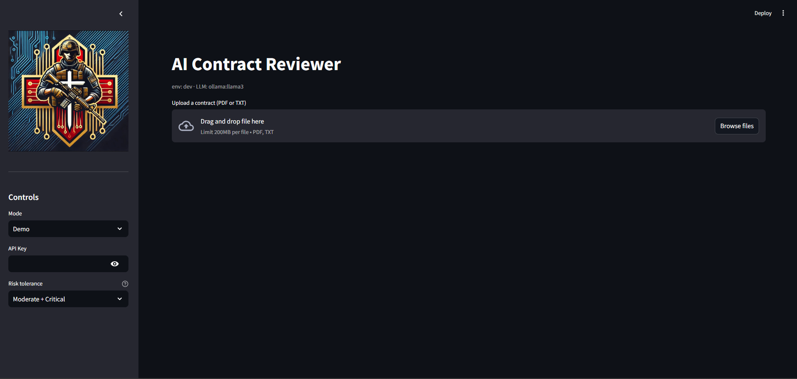
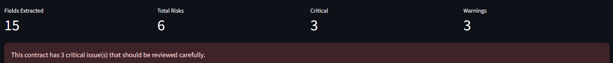
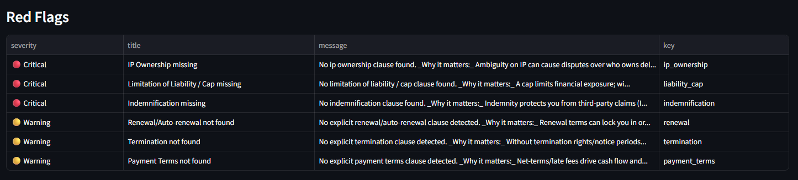
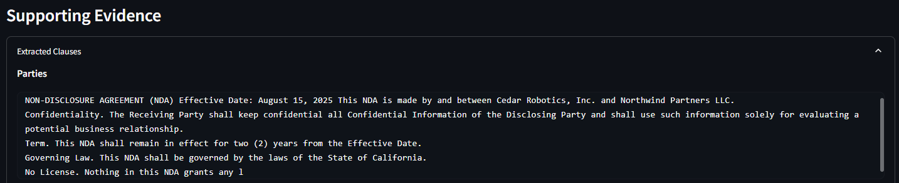
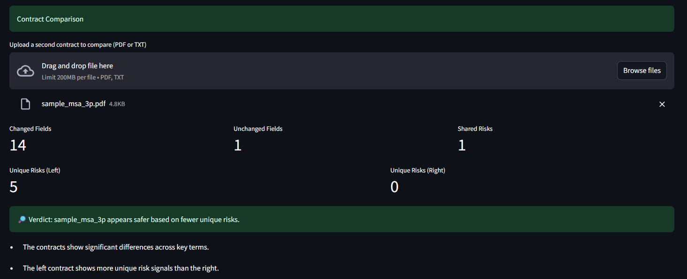
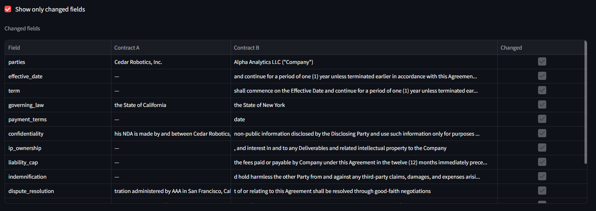

# AI Contract Reviewer (AICR)

AI-powered contract analysis and risk detection platform designed to help operators, founders, and analysts make better decisions before signing agreements.

---

## Executive Summary

Most contracts are signed without a full understanding of the risks involved.

The AI Contract Reviewer (AICR) transforms unstructured contract documents into structured insights, highlights critical risks, and enables side-by-side comparison for better decision-making.

Instead of simply summarizing documents, AICR focuses on risk detection, explainability, and decision support.

---

## Problem

Contracts often contain hidden risks that are easy to overlook:

- Missing liability caps  
- Undefined intellectual property ownership  
- Weak indemnification clauses  
- Unclear payment terms  
- Auto-renewal traps  

---

## Solution

AICR provides a structured analysis pipeline that:

- Extracts key contractual fields  
- Identifies missing or risky clauses  
- Assigns risk severity (Critical, Warning)  
- Explains why each issue matters  
- Enables contract-to-contract comparison  

---

## Key Features

### Contract Analysis
- Upload PDF or TXT contracts
- Automatic field extraction
- Structured output for key terms

### Risk Detection Engine
- Flags critical and moderate risks
- Highlights missing clauses
- Provides human-readable explanations

### Explainability Layer
- Displays supporting evidence from the contract
- Links extracted insights to source text

### Contract Comparison
- Side-by-side contract analysis
- Identifies changed and unchanged fields
- Highlights unique risks per contract
- Provides a clear decision verdict

---

## Sample Outputs

### Contract Upload Interface

### Contract Analysis Overview

### Risk Detection (Critical & Warnings)

### Supporting Evidence (Explainability)

### Contract Comparison Summary

### Contract Comparison Details

---

## System Architecture (High-Level)

1. Ingestion Layer  
2. Processing Layer  
3. Risk Engine  
4. Explainability Layer  
5. Comparison Engine  

---

## Business Impact

- Reduce legal and financial risk  
- Identify missing protections before signing  
- Compare vendor agreements with clarity  
- Save time reviewing contracts manually  

---

## Disclaimer

This repository showcases capabilities only. Core implementation is not included.
