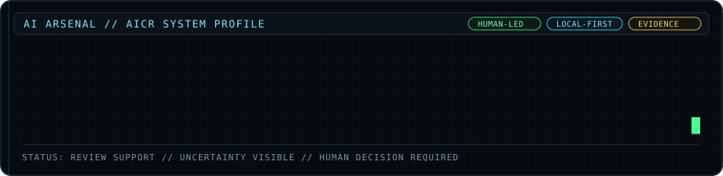

  

# AICR | AI Contract Reviewer

**Private, human-led contract review with evidence-linked findings, visible uncertainty, and governed decision support.**

AICR helps people review contracts by surfacing potential concerns, connecting findings to supporting contract language, and organizing the evidence that deserves closer attention. The software supports the review process. The human reviewer interprets the language, weighs the context, and makes the decision.

This public repository documents selected product capabilities and screenshots. The core implementation remains private.

## What AICR Does

AICR turns contract review into a structured evidence workflow:

**Contract → Finding → Supporting Language → Context / Uncertainty → Human Review**

The system is designed to help a reviewer:

- surface potential concerns and missing protections
- extract important contractual terms
- connect findings to supporting source language
- inspect surrounding contract context
- compare agreements and changed terms
- expose when supporting evidence was not detected
- keep consequential judgment with a human reviewer

## Why This Matters

Contract review is often an attention problem. Important language can be buried across long agreements, related terms can appear in different sections, and missing protections are easy to overlook when time is limited.

AICR is designed to direct attention toward the language that may deserve closer review without pretending the system has final authority.

## Evidence and Human Review

AICR is built around evidence before confidence.

When the system surfaces a finding, the reviewer should be able to inspect the contract language connected to that finding rather than rely on an unsupported conclusion. Where relevant source language is not detected, the workflow should make that limitation visible instead of presenting certainty that the evidence does not support.

AICR does not replace interpretation, negotiation, professional judgment, or legal advice. The human remains responsible for the final decision.

## Core Capabilities

### Contract Review
- structured review of uploaded contract documents
- extraction of key contractual fields and terms
- findings organized for human review

### Finding and Evidence Workflow
- potential concerns and missing protections surfaced for review
- supporting contract language displayed with findings
- surrounding clause context available to the reviewer
- visible "not detected" or missing-evidence states where appropriate

### Contract Comparison
- side-by-side comparison of agreements
- changed and unchanged fields surfaced clearly
- contract-specific findings organized for review

### Reporting and Review Support
- structured outputs designed to reduce manual review friction
- evidence-first presentation that supports verification before reliance
- human-led workflow rather than autonomous decision-making

## Privacy and Governance

AICR is designed around a local-first, privacy-conscious operating model for sensitive contract workflows.

The product direction emphasizes:

- private review of sensitive documents
- human approval and human judgment
- evidence-linked findings
- visible uncertainty and detection limits
- controlled usage and governance boundaries
- verification before reliance

The goal is not to make AI sound certain. The goal is to make the review process clearer, more inspectable, and easier for a person to verify.

## Product Screenshots

The screenshots below show an earlier documented version of AICR. Updated product images and an evolution walkthrough will be added as the current interface is documented.

### Contract Upload Interface

### Contract Analysis Overview

### Findings and Risk Review

### Supporting Contract Evidence

### Contract Comparison Summary

### Contract Comparison Details

## High-Level Architecture

At a high level, AICR separates the review workflow into distinct responsibilities:

1. **Document Ingestion**
2. **Contract Processing and Extraction**
3. **Finding Detection**
4. **Evidence and Context Presentation**
5. **Contract Comparison**
6. **Human Review**

This public description intentionally stays at the product-architecture level. Internal implementation details are not published in this repository.

## What AICR Does Not Do

AICR is not presented as an attorney, an autonomous legal decision-maker, or a guarantee that every issue in a contract will be detected.

It does not remove the need to verify source language, consider business context, or seek qualified professional advice when appropriate.

## Current Product Direction

AICR is being developed as part of **AI Arsenal**, a portfolio of practical AI and data systems built around evidence, privacy, governance, and human judgment.

Current product work focuses on making contract review more structured, inspectable, and useful without removing human accountability from the workflow.

## Explore AI Arsenal

- [AI Arsenal Portfolio](https://sophos333.github.io/OscarAIArsenal/)
- [Oscar Holguin-Silva on GitHub](https://github.com/Sophos333)
- [LinkedIn](https://www.linkedin.com/in/yashuasspear-oscar-holguin-silva/)

## Disclaimer

This repository showcases selected AICR capabilities and product direction only. Core implementation is not included.

AICR provides review support and decision support. It does not provide legal advice and should not be treated as a substitute for qualified professional review when that is required.
